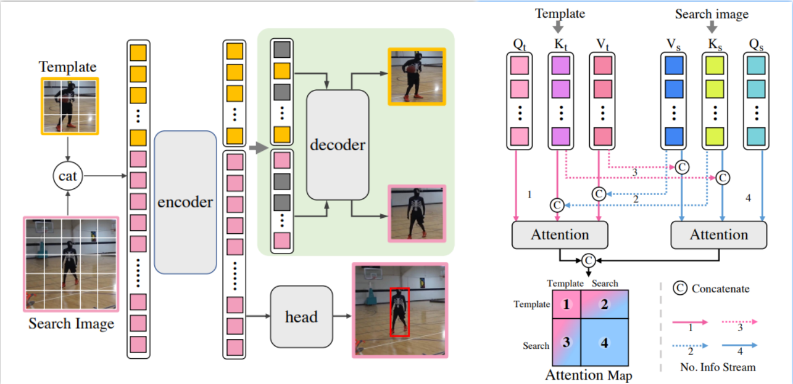
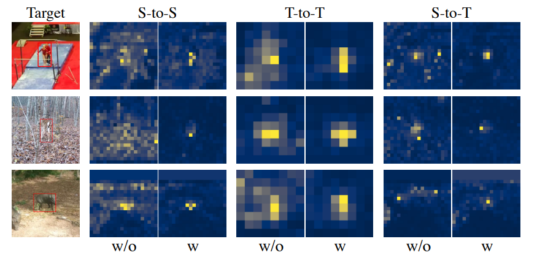

# **CTTrack**
The official implementation of the AAAI 2023 paper **<u>Compact Transformer Tracker with Correlative Masked Modeling</u>**

[[Models and Raw results]](https://drive.google.com/drive/folders/1xmlOzwIu_2Jexzzl69MCPFXBip1MgSbf?usp=sharing) (Google Driver)  [[Models and Raw results]](https://pan.baidu.com/s/1TCdIHfwxnlLDed98fzbyFg) (Baidu Driver: RLBW)



## News

**[ Nov 18, 2023]**

- MixFormer is accepted to <font color='red'> **AAAI2023** </font>.
- We release Code, models and raw results.

## Highlights

### :sparkles: New transformer tracking framework

pass

### :sparkles: End-to-end, Positional-embedding-free, multi-feature-aggregation-free

pass

### :sparkles: Strong performance

| Tracker               | UAV123 (P) | LaSOT (NP) | TrackingNet (AUC) | GOT-10k (AO) |
| --------------------- | ---------- | ---------- | ----------------- | ------------ |
| **CTTrack**           | **93.3**   | 79.7       | **84.9**          | **72.8**     |
| MixFormer* (CVPR2022) | 91.0       | 79.9       | 83.9              | 70.7         |
| CSWinTT* (CVPR2022)   | 90.3       | 75.2       | 81.9              | 69.4         |
| UTT                   | -          | -          | 79.7              | 67.2         |
| STARK (ICVV2021)      | -          | 77.0       | 82.0              | 68.8         |
| TransT (CVPR2021)     | 87.6       | 73.8       | 81.4              | 67.1         |
| TrDiMP (CVPR2021)     | 87.6       | 73.2       | 78.4              | 68.8         |
| STMTrack (CVPR2021)   | -          | 69.3       | 80.3              | 64.2         |
| AutoMatch (ICVV2021)  | 83.8       | 67.5       | 76.0              | 65.2         |
| SiamGAT (CVPR2021)    | 84.3       | 63.3       | -                 | 62.7         |
| KYS (ECCV2020)        | -          | 63.3       | 74.0              | 63.6         |
| SiamAttn (CVPR2020)   | 84.5       | 64.8       | 75.2              | -            |
| SiamFC++ (AAAI2020)   | 80.4       | 62.3       | 75.4              | 59.5         |
| SiamRPN++ (CVPR2019)  | 84.0       | 56.9       | 73.3              | 51.7         |
| DiMP (ICCV2019)       | 84.9       | 66.4       | 74.0              | 61.1         |
| ATOM (CVPR2019)       | 82.7       | 57.6       | 70.3              | 55.6         |

## Install the environment

```
conda create -n cttrack python=3.7
conda activate cttrack
bash install.sh
```

## Data Preparation
Put the tracking datasets in ./data. It should look like:
   ```
   ${CT-TRACK_ROOT}
    -- data
        -- lasot
            |-- airplane
            |-- basketball
            |-- bear
            ...
        -- got10k
            |-- test
            |-- train
            |-- val
        -- trackingnet
            |-- TRAIN_0
            |-- TRAIN_1
            ...
            |-- TRAIN_11
            |-- TEST
   ```
## Set project paths

Run the following command to set paths for this project

```
python tracking/create_default_local_file.py --workspace_dir . --data_dir ./data --save_dir .
```
After running this command, you can also modify paths by editing these two files
```
lib/train/admin/local.py  # paths about training
lib/test/evaluation/local.py  # paths about testing
```

## Train CTTrack

### Train CTTrack-B

```
python tracking/train.py --script cttrack --config baseline --save_dir . --mode single
python tracking/train.py --script cttrack_online --config baseline --save_dir . --mode single --script_prv cttrak --config_prv baseline  
```
### Train CTTrack-L
```
python tracking/train.py --script cttrack --config baseline_L --save_dir . --mode single
python tracking/train.py --script cttrack_online --config baseline_L --save_dir . --mode single --script_prv cttrak --config_prv baseline  
```
## Test and evaluate CTTrack on benchmarks

### Test CTTrack-B

- OTB2015
```
python tracking/test.py cttrack baseline --dataset otb --threads 32
```
- UAV123
```
python tracking/test.py cttrack baseline --dataset uav --threads 32
```
- LaSOT
```
python tracking/test.py cttrack baseline --dataset lasot --threads 32
```
- GOT10K-test
```
python tracking/test.py cttrack baseline --dataset got10k_test --threads 32
```
- TrackingNet
```
python tracking/test.py cttrack baseline --dataset trackingnet --threads 32
```
### Test CTTrack-L
- OTB2015
```
python tracking/test.py cttrack baseline_L --dataset otb --threads 32
```
- UAV123
```
python tracking/test.py cttrack baseline_L --dataset uav --threads 32
```
- LaSOT
```
python tracking/test.py cttrack baseline_L --dataset lasot --threads 32
```
- GOT10K-test
```
python tracking/test.py cttrack baseline_L --dataset got10k_test --threads 32
```
- TrackingNet
```
python tracking/test.py cttrack baseline_L --dataset trackingnet --threads 32
```

### Evaluate CTTrack

**LaSOT/GOT10k-test/TrackingNet/OTB100/UAV123**

```
python tracking/analysis_results.py {tracker_name} {config} --dataset {dataset_name}
```

**For example**

```
python tracking/analysis_results.py cttrack baseline_L --dataset trackingnet
```

**VOT2020**

Before evaluating "CTTrack" on VOT2020, please install  VOT toolkit which is required to evaluate our tracker. To download and install VOT toolkit, you can follow this [tutorial](https://www.votchallenge.net/howto/tutorial_python.html). For convenience, you can use our example workspaces of VOT toolkit under ```external/vot20/``` by setting ```trackers.ini```.

```
cd external/vot20/<workspace_dir>
vot evaluate --workspace . MixFormerPython
# generating analysis results
vot analysis --workspace . --nocache
```

## Visualize attention maps



## Model Zoo and raw results

[[Models and Raw results]](https://drive.google.com/drive/folders/1xmlOzwIu_2Jexzzl69MCPFXBip1MgSbf?usp=sharing) (Google Driver)  [[Models and Raw results]](https://pan.baidu.com/s/1TCdIHfwxnlLDed98fzbyFg) (Baidu Driver: RLBW)

## Contact

Zikai Song: SkyeSong@hust.edu.cn 

Run Luo: lr_8823@hust.edu.cn

## Acknowledgments

* Thanks for [PyTracking](https://github.com/visionml/pytracking) Library and [STARK](https://github.com/researchmm/Stark) Library, which helps us to quickly implement our ideas.
* We use the implementation of the CvT from the official repo [CvT](https://github.com/leoxiaobin/CvT).  

## Citation

If you think this project is helpful, please feel free to leave a star⭐️ and cite our paper:

```
@InProceedings{Cui_2022_CVPR,
   author    = {Cui, Yutao and Jiang, Cheng and Wang, Limin and Wu, Gangshan},
   title     = {MixFormer: End-to-End Tracking With Iterative Mixed Attention},
   booktitle = {Proceedings of the IEEE/CVF Conference on Computer Vision and Pattern Recognition (CVPR)},
   month     = {June},
   year      = {2022},
   pages     = {13608-13618}
}
```

pass